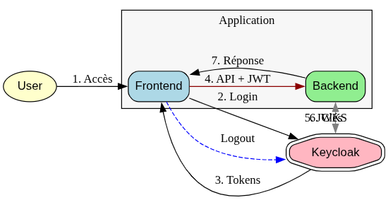

# Rapport Technique : Sécurisation d’une Application E-Learning avec OAuth2 et OpenID Connect

## Introduction
Ce projet s'inscrit dans le cadre de la mise en place d'une architecture de sécurité moderne pour une plateforme universitaire de E-Learning. L'objectif principal est d'assurer l'authentification centralisée (SSO) et la gestion des autorisations via le protocole **OAuth2** et sa couche d'identification **OpenID Connect (OIDC)**.

L'architecture repose sur trois composants majeurs :
1.  **Keycloak** : Serveur de gestion des identités et des accès (IAM).
2.  **Spring Boot** : Backend API agissant comme *Resource Server*.
3.  **React** : Frontend agissant comme *Client* public.

## Sommaire
1.  Architecture du Projet
2.  Configuration du Serveur d'Identité (Keycloak)
3.  Implémentation du Backend (Spring Boot)
4.  Implémentation du Frontend (React)
5.  Démonstration et Scénarios de Test
6.  Conclusion
7.  Webographie

---

## 1. Architecture du Projet
L'architecture logicielle suit le modèle standard OAuth2. Keycloak agit comme l'autorité centrale de confiance, délivrant des jetons JWT que le Frontend (React) transmet au Backend (Spring Boot) pour accéder aux ressources protégées.

---

## 2. Configuration du Serveur d'Identité (Keycloak)

### 2.1 Déploiement et Initialisation
Keycloak est déployé via un conteneur Docker.

### 2.2 Configuration du Realm et des Utilisateurs
Un Realm dédié `elearning-realm` a été créé pour isoler les données de l'application. Deux utilisateurs de test ont été provisionnés : `admin1` et `user1`.

### 2.3 Gestion des Rôles (RBAC)
Deux rôles principaux ont été définis :
* `ROLE_ADMIN` : Accès complet.
* `ROLE_STUDENT` : Accès en lecture seule.

### 2.4 Configuration du Client OIDC
Le client `react-client` est configuré en mode **Public** avec une URI de redirection autorisant `http://localhost:3000/*`.

---

## 3. Implémentation du Backend (Spring Boot)

Le backend est une application Java Spring Boot configurée en tant que *OAuth2 Resource Server*.

### 3.1 Structure du Projet
Organisation des packages respectant l'architecture en couches (Controller, Service, Repository, Security Config).

### 3.2 Configuration de la Sécurité
Le fichier `application.properties` définit l'URI de l'émetteur (Issuer) pour la validation des tokens JWT.

La classe `SecurityConfig` implémente la chaîne de filtres de sécurité et le mapping des rôles OIDC vers les autorités Spring Security.

### 3.3 Contrôleurs API
Le `CourseController` expose les endpoints REST sécurisés par les annotations `@PreAuthorize`.

### 3.4 Exécution
Le serveur démarre sur le port 8081 (Tomcat).

---

## 4. Implémentation du Frontend (React)

Le frontend utilise `keycloak-js` pour gérer le cycle de vie de l'authentification.

### 4.1 Structure du Projet React

### 4.2 Démarrage du Client
L'application client tourne sur le port 3000.

---

## 5. Démonstration et Scénarios de Test

### 5.1 Redirection vers l'Authentification
Lors de l'accès à l'application, l'utilisateur non authentifié est automatiquement redirigé vers la page de login Keycloak.

### 5.2 Accès Autorisé (Zone Admin)
Une fois connecté avec un compte disposant du rôle `ROLE_ADMIN`, l'utilisateur accède à la plateforme et peut visualiser les fonctionnalités d'administration.

---

## 6. Conclusion
Ce travail pratique a permis de mettre en œuvre une chaîne de sécurité complète basée sur les standards de l'industrie (OAuth2/OIDC). L'externalisation de l'authentification vers Keycloak permet de décharger les applications métiers (Spring/React) de la gestion complexe des mots de passe et des sessions, tout en garantissant une granularité fine des droits d'accès.

## 7. Webographie
* Documentation officielle Keycloak : https://www.keycloak.org/documentation
* Spring Security OAuth2 Resource Server : https://docs.spring.io/spring-security/reference/servlet/oauth2/resource-server/index.html
* Keycloak JS Adapter : https://www.npmjs.com/package/keycloak-js